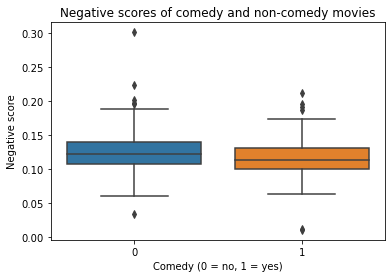
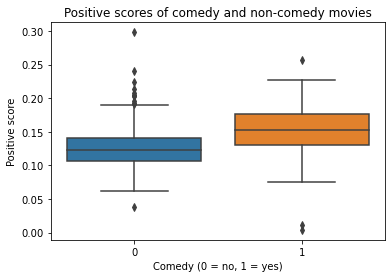

# Sentiment Scores of Movie Scripts and   Their Performance on Comedy Classification Task

## Table of Contents  
- [Introduction](https://github.com/krystal2710/movie_scripts_sentiments/blob/main/report.md#a-introduction)                                       
- [Methods and Data](https://github.com/krystal2710/movie_scripts_sentiments/blob/main/report.md#b-methods-and-data)
- [Results](https://github.com/krystal2710/movie_scripts_sentiments/blob/main/report.md#c-results)
- [Analysis/Discussion](https://github.com/krystal2710/movie_scripts_sentiments/blob/main/report.md#d-analysisdiscussion)
- [References](https://github.com/krystal2710/movie_scripts_sentiments/blob/main/report.md#e-references)

## A. Introduction

Literary work has always been an important aspect of life. People express their opinions and hopes through literature. In a digitalized society nowadays, films, a special type of literary work, serve as means for human to express their feelings, hopes, opinions, etc about the society around them. Films are influenced by culture, but films can also influence culture itself. Studying the sentiments films convey and evoke in the viewers can be a great starting point to understand this two-way relationship between films and culture. 

In order to study sentiments, many scholars, in the past, have come up with sentiment analysis, the field of identifying, analyzing and studying people's sentiments and opinions towards entities. Little attention had been paid to people's opinions and sentiments before the year 2000 because of the lack of large volume of opinionated data and applications. However, in the past few years, sentiment analysis has been developed and made a significant impact on not only research in NLP but also in other humanities and social science fields (Liu, 2012). In a world where people have the tendency to express their opinions more and more frequently, the opinionated data contributes greatly to the study of culture. Sentiment analysis is used enormously on data regarding social media, product reviews, debates, etc. In this research project, I use sentiment analysis on movie scripts. Currently, using sentiment analysis on movie scripts is not very popular, and not many successful instances have been made. In `Emotion and Sentiment Analysis from a Film Script: A Case Study`, Dr. Yu and Dr. Kim use NLTK sentiment analysis for Plutchik’s 8 emotion types on film scripts. However, the overall matching rate between manual tagging and NLTK sentiment analysis for Plutchik’s 8 emotion types is much worse than the overall matching rate between two human taggers. 

My project approaches movie scripts with the goal of trying to get the information of what sentiments movies imply from the movie scripts to a decent level of accuracy. It also leverages the problems by using the sentiment scores for comedy classification task to see whether sentiment scores help with better classifying comedy from non-comedy movies. I choose Comedy instead of other genres because unlike Drama, Thriller, Comedy often has distinct words that are extremely positive. I hypothesize that these words would make the classification task become much easier.

There is no background knowledge needed to understand this project in terms of the domain area. However, in terms of test analysis, I use VADER and TextBlob Sentiment Analysis to perform the initial sentiment analysis on the movie scripts. Details about how VADER works can be found on this article, ['VADER Sentiment Analysis Explained'](https://medium.com/@piocalderon/vader-sentiment-analysis-explained-f1c4f9101cd9), and this paper, ['VADER: A Parsimonious Rule-based Model for Sentiment Analysis of Social Media Text'](https://comp.social.gatech.edu/papers/icwsm14.vader.hutto.pdf), which first introduced VADER. Details about how TextBlob work can be found at ['Sentiment Analysis using TextBlob
'](https://medium.com/analytics-vidhya/sentiment-analysis-using-textblob-ecaaf0373dff). In addition, I use TF-IDF, Logistic Regression and k-nearest neighbors in my project. Details about these methods can be found at ['TF-IDF for document ranking from scratch in Python on Real World Dataset'](https://towardsdatascience.com/tf-idf-for-document-ranking-from-scratch-in-python-on-real-world-dataset-796d339a4089) and the book 'An Introduction to Statistical Learning' (James et al., 2021).

## B. Methods and Data

### I. Data
In my project, I scrape the 644 movie scripts from the [Internet Movie Script Database (IMSDb) website](https://imsdb.com) and extract the metadata of the corresponding movies from several datasets on [IMDb Datasets website](https://www.imdb.com/interfaces/). There are more than 1,000 movie scripts from the IMSDb website but I only scrape 644 movie scripts because some of the movies have the titles displayed but no scripts are found, and some of the movies are not in the IMDb database. 

Choosing only movie scripts available from the IMSDb can affect the results because these movies are often popular movies and may not be representative of all English movies. However, this can also be a benefit as these popular movies can have more implications of culture than other movies. These implications are discussed later in the paper. 

For illustrative purposes, below is a part of the script from '12 and Holding' - by Anthony S Cipriano:
                               
                             12 AND HOLDING
          
          
                               Written by
          
                           Anthony S Cipriano
          
          
          
          
                                                          04.06.04
          
          
          
          FADE IN:
          
          EXT. NEIGHBORHOOD STREET - MORNING
          
          TWIN BOYS, RUDY AND JACOB CARGES (12), ride their bikes
          through a suburban neighborhood.
          
          Rudy, the more athletic of the two, rides at a breakneck
          pace. Jacob rides slowly due to a HOCKEY MASK that he wears
          over his face. It's making it difficult for him to see. The
          boys turn down a DIRT PATH and ride deep into some WOODS.
          
          INT. WOODS - CONTINUOUS
          
          Rudy and Jacob ride to the edge of a CLEARING and stop.
          Across from the clearing is a large OAK TREE, which has a
          TREE HOUSE perched high up in it's branches. The boys
          cautiously look around and whisper.
          
                               JACOB
                     You see `em?
          
                               RUDY
                     No. But that doesn't mean they're
                     not here.

Each script is slightly different from one another in terms of the introduction part (name of the movie, writer(s), date, etc). However, there is often no difference between the main part of the scripts. Every script comes with dialogues, some description of the scenes and the actions taken by the characters.

Besides the scripts, the table below lists all of the variables in the metadata:

| Variable name | Data type   |                Description                     | 
| ------------- | ----------- | -------------------------------------------    |
|    tconst     | characters  | alphanumeric unique identifier of the title    |
|    title      | characters  | the localized title                            |
|    isAdult    | categorical | 0: non-adult title; 1: adult title             |
|   startYear   | numerical   |represents the release year of a title          |
|runtimeMinutes | numerical   | primary runtime of the title, in minutes       | 
|    genres     | categorical | genres associated with the title               |
|  file_name    | characters  | the name of file containing the title's script |
| averageRating	| numerical   | weighted average of user ratings               |
|   numVotes    | numerical   | number of votes the title has received         |

`genre` is my dependent variable. The independent variables are the TF-IDF and the sentiment scores extracted from the scripts.

### II. Methods

My central computation include:
1. Extract sentiments from the movie scripts, assess and make improvements on the sentiment scores
2. Train Machine Learning models to classify comedy based on the TF-IDF scores extracted from the scripts and the sentiment scores separately

For the first computation task, it helps with the first part of my research questions: trying to get the information of what sentiments films imply from the movie scripts to a decent level of accuracy. The second and third computation task answer using the sentiment scores for genre classification tasks to see whether sentiment scores help with better classifying some particular movie genres. 

### 1. Extract sentiments

For this part, I most focus on extracting negative and positive sentiments as those are the two most popular sentiments. In addition, with these two sentiments, it is reasonable to hypothesize that these scores may help with classifying some obviously positive or negative genres like Comedy or Horror.

One of the problems that I first encounter with this task is the lack of labeled data. Doing an unsupervised sentiment analysis means that there are no prelabeled data to determine the accuracy of the sentiment scores. Therefore, I label 30 movies I watched in the metadata as either positive or negative. Those movies I choose to label are mostly extremely negative or positive. These movies would be used as a gut check to see whether the sentiments I extract from the text is relatively right. My method used here is based halfly on semi-supervised learning in the way that I label some of the data, use them to fine-tune my model and then apply the model to other observations in the dataset (Hady et al., 2013). The advantage of this method is that I don't have to spend a great deal of time on labeling all the movie scripts. In addition, because those 30 movie scripts are the ones that I watched and are some extreme cases that I know for sure is negative/positive, it reduces the possibilities of wrongly label some scripts. Some examples include Taxi Driver (neg), Aladdin (pos), Final Destination 2 (neg), Toy Story (pos), etc. However, the disadvantage of the method is the small number of labeled data. The model that is fine-tuned based on this small number of labeled data may contain bias. In future and larger scale research, more data should be labeled. Given my time constraints, the method is relatively good. 

To extract sentiments from the text, I use VADER and TextBlob Sentiment Analysis tools. These are two of the most popular sentiment analysis currently available. TextBlob and VADER are both lexicon-based methods which map each words in the text with designated sentiment scores and calculate the sentiment scores of the text in general. In my project, I look at the polarity score which ranges from -1 (extremely negative) to 1 (extremely positive). This score in TextBlob is the same as the VADER compounded score. There are advantages and disadvantages coming with whether I should use TextBlob or VADER. VADER is more focused on informal text such as tweets or messages, while TextBlob is more focused on formal text (GrabNGoInfo, 2022). In this situation, a movie script can be considered as formal text. However, there are dialogues in the script that may be informal depending on the movie itself. Therefore, I use both tools and choose one that performs better on my labeled data. 

Besides using TextBlob and VADER on the document level, I also try to improve the performance of the tools by using it on the sentence level and calculate the average. This may be better at putting less weight on sentences that are neutral. Since text is typically neutral, in the efforts of better identifying the positivity and negativity in text, I exclude stopwords and names from the scripts. I also make an attempt to excluding sentences that convey no positivity or negativity. These sentences are typically just some description of the scenes or characters. The description of some scenes/characters are important, but some are not. 

All what I've done is just trying different ways to extract sentiments. The final way that I decide on should be a mix of good accuracy and reasonable sentiment scores.

### 2. Train Machine Learning models

In this part of the project, I first create a new variable, `comedy`, which is a categorical variable to indicate whether the genre of the movies include comedy or not. I then process the scripts into tokens with stopwords and names removed and calculate the TF-IDF scores. TF-IDF stands for Term Frequency - Inverse Document Frequency. Getting TF_IDF score of a specific word in a document is the same as getting the term frequency of it in the document divided by the inverse document frequency of itself. The articles suggested in the Introduction section should give more information about how TF-IDF words. I use TF-IDF because it is one of the most popular method to represent a document and it takes into account the frequency of a specific word in the entire document in order to determine its importance. Words that appear many times in the corpus are given less weight, and words that appear fewer times in the corpus are given more weight. This ensures that the model can take the unique aspect of each document to compare. 

After getting all the necessary independent variables, I split the data set into training set (75%) and test set (25%) for validation purpose. I use stratified sampling which ensures that the training-test split have the same portion of Comedy and Non-comedy movies as the original dataset. There are 200 Comedy movies and 444 Non-comedy movies. There is class imbalance but it is not very bad so I decide not to do anything about it now. I then first train a Logistic Regression model on the TF_IDF scores only and on the sentiment scores only. I do the same using k-nearest neighbors (KNN). I choose these two algorithms instead of others because my goal is not to make the best prediction I can but to see whether the sentiment scores create better prediction and make some interpretations. LR and KNN are the two simplest and highly interpretative algorithms. There are also not many hyperparameters to tune in these two models. 

I also take one further step to standardize the sentiment scores because I notice that the negative and positive scores are often low, while the compound and the neutral scores are high. 

## C. Results

### 1. Extract sentiments

The table below shows various results that I get from trying different ways to extract the sentiments from my 30 labeled scripts:

|Methods|Accurate Predictions|Accuracy|
|-|-|-|
|VADER - document level|23/30|76.6|
|TextBlob - document level|22/30|73.3
|VADER - sentence-based|22/30|73.3|
|TextBlob - sentence-based|23/30|76.6|
|VADER - document level with stopwords, names removed|25/30|86.6|
|TextBlob - document level with stopwords, names removed|23/30|76.6|
|VADER - sentence-based with stopwords, names removed|22/30|73.3|
|TextBlob - sentence-based with stopwords, names removed|22/30|73.3|
|VADER - sentence-based with neutral sentences, stopwords, names removed|22/30|73.3
|TextBlob - sentence-based with neutral sentences, stopwords, names removed|22/30|73.3|

The table indicates that TextBlob does not work well in this situation. When using TextBlob, the highest accuracy is 76.6, while it is 86.6 for VADER. This may be because, as I wrote at the beginning, there are a great deal of informal conversations in the scripts. The table also shows that when removing the stopwords and names, the sentiment analysis improves slightly. USing VADER and TextBlob at the document level with stopwords, names removed yields results of 86.6 and 76.6 respectively. VADER at the document level with stopwords, names removed also yields the highest accuracy. Therefore, I move forward with this method of extracting sentiments. In the Analysis/Discussion section, I discuss some of the misclassified examples further.

### 2. Train Machine Learning models

The comedy variable shows that there are 200 Comedy movies and 444 Non-comedy movies. The boxplots below show how the negative and positive scores are different between comedy and non-comedy movies.

The boxplot shows the negative scores of comedy and non-comedy movies. It is clear that the non-comedy movies have slightly higher negative scores than comedies. The negative scores in non-comedy movies are approximately from 0.11 (25th percentile) to 0.14 (75th percentile). On the other hand, the negative scores in comedies are approximately from 0.10 (25th percentile) to 0.13 (75th percentile). These seem to be small differences but we have to keep in mind that the scale of these scores are really small.

The boxplot shows the positive scores of comedy and non-comedy movies. It is clear that the comedies have relatively higher positive scores than non-comedy movies. The positive scores in non-comedy movies are approximately from 0.11 (25th percentile) to 0.14 (75th percentile). On the other hand, the positive scores in comedies are approximately from 0.125 (25th percentile) to 0.175 (75th percentile). These seem to be small differences but we have to keep in mind that the scale of these scores are really small. Overall, the two box plots show that comedies tend to have higher positive scores, while non-comedy movies tend to have higher negative scores. There are also more outliers in non-comedy movies than in comedies.

For the model training part, below are the results of training Logistic Regression (LR) and k-nearest neighbors (KNN) models:

|Model|Accuracy|F1|AUC|Training Time|
|-|-|-|-|-|
|LR with TF-IDF|0.7|0.11|0.78|1.96 secs|
|LR with sentiment scores|0.69|0|0.73|0.006 secs|
|LR with standardized sentiment scores|0.75|0.45|0.72|0.004 secs|
|KNN with TF-IDF|0.76|0.53|0.74|0.003 secs|
|KNN with sentiment scores|0.76|0.51|0.72|0.003 secs|
|KNN with standardized sentiment scores|0.75|0.52|0.725|0.0005 secs

The table gives information about the types of models, the Accuracy, F1, AUC scores, and the training time. In general, KNN does a better job the LR at classifying the genres. Both sentiment scores and TF-IDF scores do equally well, except for the LR model trained on unmodified sentiment scores with an F1 of 0. An F1 of 0 and Accuracy of 0.69 indicates that either the Sensitivity or Specificity is low. Overall, the training time of KNN models is smaller than the training time of LR models. This is because KNN only has to calculate the distance between scripts once, while LR has to find the coefficients for every predictors. The training time of LR with TF-IDF (1.96 seconds) is approximately 325 times as slow as the training time of other models. The training time, as a whole, is faster with sentiment scores than with TF-IDF because of the large number of predictors (125,263 words) when training with TF-IDF.

The best model is KNN with TF-IDF. It has an Accuracy of 0.76, a F1 of 0.53 and an AUC of 0.74 and is trained in only 0.003 seconds. The second best model is KNN with standardized sentiment scores with an Accuracy of 0.75, a F1 of 0.52 and an AUC of 0.725. KNN with sentiment scores model actually has a higher Accuracy and F1 but I prioritize AUC and the training time more because by changing the threshold, we can get a better Accuracy and F1 score of a model. 

The next tabel show the top 10 positive coefficients of LR with TF-IDF:

||term|coefficient|
|-|-|-|
|64680|	m	|1.260208
|75713|	oh	|1.049245
|118835|	vitti|	0.943770|
|87826|	re|	0.852476|
|58079|	juno|	0.694292|
|124003|	yeah|	0.683581|
|87959|	really|	0.660389|
|120647|	well|	0.646143|
|59676|	know|	0.601278|
|28807|	dignan|	0.598950|
|71327|	mumford|	0.588162|
|46210|	gru	|0.580912|
|44834|	gonzo|	0.579312|
|51499|	hopps|	0.577220|
|3002|	alvy|	0.571166|
|40162|	foley|	0.561902|
|87585|	rath|	0.557944|
|97925|	shrek|	0.557277|
|57686|	joon|	0.556212|
|68813|	mini|	0.552279|

The most positive coefficient is 'm' which is quite meaningless. Some of the positive coefficients that seem to have meaning and make sense to me include 'oh', 'yeah', 'really', 'well','know','dignan'. One thing that I notice from this table of coefficients is that there are some names like 'shrek' and 'alvy' and many seemingly meaningless words like 'm', 're','gru', etc.

The next tabel show the top 10 negative coefficients of LR with TF-IDF:

||term|	coefficient|
|-|-|-|
|36755|	eyes	|-0.623640|
|36850|	face	|-0.535098|
|30664|	door	|-0.433784|
|73301|	night	|-0.431947|
|97152|	sheriff	|-0.417718|
|7052	|back	|-0.396419|
|118928	|voice	|-0.365768|
|46572	|gun	|-0.364651|
|11207	|blood	|-0.364392|
|97351	|ship	|-0.364080|
|47849	|hand	|-0.357303|
|70865	|moves	|-0.347493|
|112344	|towards|	-0.344400|
|8115	|barnes	|-0.334555|
|39792	|floor	|-0.319032|
|34899	|epps	|-0.315275|
|114138	|turns	|-0.312571|
|64073	|lovett	|-0.308834|
|65236	|mal	|-0.305686|
|9340	|behind	|-0.305638|

The most negative coefficient is 'eyes' which is quite meaningless. Many words associated with negative coefficients that don't really make sense to me include 'eyes', 'faces','door', 'hand','turns', 'towards'. Some of the negative coefficients that seem to have meaning and make sense to me include 'gun', 'night','blood','mal', etc. One thing that I notice from this table of coefficients is that there are many body parts that doesn't make any sense to be negative.

The next tabel show the coefficients of LR with sentiment scores:

|	|term|	coefficient|
|-|-|-|
|0|	neg|	-0.353698|
|1|	neu|	-0.290444|
|3|	compound|	0.179923|
|2|	pos|	0.506924|

The coefficients associated with negative, neutral, compound, positive scores are -0.35, -0.29, 0.17, 0.5 respectively. It does make sense that the higher the positive score is, the higher chance the movie is a comedy, and the higher the negative score is, the higher chance the movies is not a comedy.

## D. Analysis/Discussion

My research questions include trying to get the information of what sentiments movies imply from the movie scripts to a decent level of accuracy and using the sentiment scores for comedy classification task to see whether sentiment scores help with better classifying comedy from non-comedy movies. 

When trying to extract the sentiments from the movie scripts, using VADER - document level with stopwords, names removed has the best accuracy. This suggests that to extract sentiments better from movie scripts, VADER may be a better choice than TextBlob because of many informal conversations in the scripts. Some of the movies that always gets misclassified by VADER include 'A quiet place', 'Titanic', 'KungFu Panda', 'How to Train Your Dragon 2', etc. When taking a closer look at the scripts of these movies, it appears that although 'KungFu Panda' and 'How to Train Your Dragon 2' are animation movies that should be positive, there are many seemingly negative words like 'warriors', 'fight', 'hit', 'kick', 'protest' because of the topic of these two movies. For 'Titanic', although the story in the movie is a tragedy, the love story between two characters suggest many positive words like 'fiancee', 'love', 'happy', etc. Also, even though I have removed many names using the list of names from NLTK, one of the characters has the name 'Lovejoy' which is not in the list to be removed and hence may affect the sentiment scores. In 'A quiet place', the plot suggests that characters should be quite if they don't want to be caught. This plot makes the script full of narration, scene description and character description. These descriptions tend to be more neutral than conversations which may skew the result. These pose a potential possibility of considering n-gram models instead of unigram in order to better take the context into account.

My second research question involves using the sentiment scores for comedy classification task. Indeed, my results show that using sentiment scores result in models that are nearly as good as the models with TF-IDF. It also saves a great deal of training time and memory to store and train the large amount of data. Notice that here KNN with standardized sentiment scores only require a training time of 0.0005 seconds. Imagine implementing this with 10,000 movie scripts and other complex methods like support vector machine or neural networks, the training time would make a great difference. The coefficients also suggest that using TF-IDF generates many words that are somewhat meaningless and require more efforts to clean these up. There are also many names that are included in the top coefficients although I have cleaned these up partly. The process of cleaning these up may be tedious. In the top negative coefficients, many body parts are listed. This may be because these suggest fighting scenes. However, more work needs to be done to understand the reasons why body parts are regarded as negative. The coefficients of LR with TF-IDF, on the other hand, make a lot of sense to me. In future research, trying to classify other genres using sentiment scores would be an interesting task to discover how well sentiment scores work. My hypothesis is that it may help with horror movie classification but not very helpful when it comes to drama because of the mix between positive and negative words in this genre. 

Some of the limitations of my project include the small size of the corpus I use. I only have 644 movie scripts. These are also in English so all of the movies should be English movies. As I mentioned before, this may be beneficial as these are popular movies that people often watch. However, these are obviously not representative of millions of movies out there. Series are also a great type of media to look at. However, given the scope of my project, TV series are too computationally heavy for me. Future research should consider looking into a much bigger set of movie scripts and other type of films like tv series, short films, tv shows or other type of media like news, social media videos, radio, etc. 

## E. References 

- Bandgar, S. (2021, June 11). Sentiment analysis using TextBlob. Medium. Retrieved May 4, 2022, from https://medium.com/analytics-vidhya/sentiment-analysis-using-textblob-ecaaf0373dff 
- Bianchini, M., Maggini, M., &amp; Jain, L. (2013). Semi-supervised Learning. In Handbook on Neural Information Processing (pp. 215–239). essay, Springer Berlin Heidelberg. 
- GrabNGoInfo, A. (2022, April 11). Textblob vs. vader for sentiment analysis using Python. Medium. Retrieved May 3, 2022, from https://medium.com/@AmyGrabNGoInfo/textblob-vs-vader-for-sentiment-analysis-using-python-76883d40f9ae 
- IMDb.com. (n.d.). IMDb Datasets. IMDb. Retrieved May 3, 2022, from https://www.imdb.com/interfaces/ 
- The internet movie script database (imsdb). The Internet Movie Script Database. (n.d.). Retrieved April 28, 2022, from https://imsdb.com/ 
- James, G., Witten, D., Hastie, T., &amp; Tibshirani, R. (2021). An introduction to statistical learning: With applications in R. Springer. 
- Liu, B. (2012). Sentiment Analysis: A Fascinating Problem. In Sentiment analysis and opinion mining (pp. 7–14). essay, Morgan &amp; Claypool. 
- Scott, W. (2021, September 26). TF-IDF for document ranking from scratch in Python on Real World Dataset. Medium. Retrieved May 4, 2022, from https://towardsdatascience.com/tf-idf-for-document-ranking-from-scratch-in-python-on-real-world-dataset-796d339a4089 
